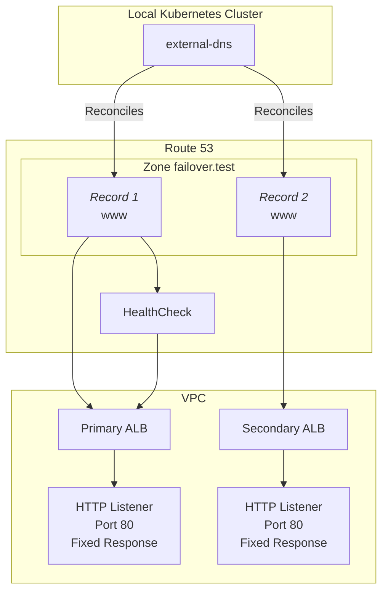

# How to Implement AWS Route53 Failover with external-dns: A Practical Guide

external-dns is widely used for DNS management in Kubernetes applications. It allows unified management of DNS records across various DNS providers, significantly reducing operational overhead.

https://kubernetes-sigs.github.io/external-dns/latest/

However, it's important to understand how well external-dns supports provider-specific features. While the official documentation mentions support for AWS Route53's failover functionality, I wanted to verify its practical integration capabilities through hands-on testing.

https://docs.aws.amazon.com/Route53/latest/DeveloperGuide/dns-failover.html

This article provides a detailed explanation of how to configure AWS Route53 failover using external-dns, based on practical verification.

## TL;DR

- external-dns fully supports AWS Route53 failover
- However, you need to create Health Checks manually (outside external-dns's responsibility)
- external-dns can create records with failover configuration when you set the health check ID in Kubernetes objects

## Test Environment Architecture

We'll use the following setup for our verification:

1. AWS Configuration
   - Two ALBs (Primary/Secondary)
   - Route53 failover configuration
   - Health check configured for Primary ALB

2. Kubernetes Configuration
   - external-dns running on local Kubernetes cluster
   - DNS records managed using CRDs



### Why This Architecture?

In production environments, you typically have applications like EC2 instances or ECS tasks behind ALBs. However, for this verification, we're using ALB's Fixed Response feature to simplify the setup by omitting the application layer.

Fixed Response is a listener action in ALB that returns a predefined response to requests. Using this feature, we can:

- Have Primary ALB return 200 HTTP status during normal operation
- Change it to return 503 HTTP status during failure simulation

This makes failover testing straightforward.

### How Failover Works

The failover mechanism works as follows:

1. Normal Operation
   - Client requests are forwarded to Primary ALB
   - Primary ALB returns 200 OK

2. During Failure
   - Primary ALB starts returning 503
   - Route53 health check marks Primary ALB as "Unhealthy"
   - Route53 automatically switches DNS records
   - Client requests are forwarded to Secondary ALB

## Prerequisites

### Required Resources

- AWS Account
- AWS credentials (access key/secret key)
- Local Kubernetes cluster (e.g., k3d)

### Required Tools

- awscli: For AWS resource operations
- terraform: For infrastructure setup
- httpie: For API testing (curl can be used instead)
- dig: For DNS record verification

### AWS Credentials Setup

```bash
export AWS_ACCESS_KEY_ID="your_access_key"
export AWS_SECRET_ACCESS_KEY="your_secret_key"
export AWS_REGION="ap-northeast-1"
```

Verify credentials are set correctly:

```bash
aws sts get-caller-identity
```

## Setting Up the Test Environment

### Important: external-dns Scope of Responsibility

external-dns is a tool specifically focused on "DNS record management". Therefore, the following resources are outside its scope and need to be created separately:

- Route53 zone
- Route53 Health Check
- Infrastructure resources like ALB

We'll create these resources using Terraform.

### 1. Creating AWS Resources

Create `main.tf` and define the necessary resources.

```bash
# Initialize Terraform
terraform init

# Create resources
terraform apply
```

<details>
<summary>View main.tf</summary>

```hcl:main.tf
terraform {
  required_providers {
    aws = {
      source  = "hashicorp/aws"
      version = "~> 5.0"
    }
  }
}

provider "aws" {
  region = "ap-northeast-1" # Tokyo region
}

# Common tags for all resources
locals {
  common_tags = {
    Environment = "demo"
    Project     = "route53-failover"
    Purpose     = "external-dns-and-failover-testing"
    Terraform   = "true"
  }
}

# Use default VPC and its public subnets
data "aws_vpc" "default" {
  default = true
}

data "aws_subnets" "public" {
  filter {
    name   = "vpc-id"
    values = [data.aws_vpc.default.id]
  }
}

# Security Group for ALBs
resource "aws_security_group" "alb" {
  name        = "alb-failover-demo"
  description = "Allow HTTP inbound traffic for failover demo"
  vpc_id      = data.aws_vpc.default.id

  ingress {
    description = "HTTP from anywhere"
    from_port   = 80
    to_port     = 80
    protocol    = "tcp"
    cidr_blocks = ["0.0.0.0/0"]
  }

  egress {
    from_port   = 0
    to_port     = 0
    protocol    = "-1"
    cidr_blocks = ["0.0.0.0/0"]
  }
  
  tags = local.common_tags
}

# Primary ALB
resource "aws_lb" "primary" {
  name               = "alb-failover-demo-primary"
  internal           = false
  load_balancer_type = "application"
  security_groups    = [aws_security_group.alb.id]
  subnets           = slice(data.aws_subnets.public.ids, 0, 2)

  tags = local.common_tags
}

# Secondary ALB
resource "aws_lb" "secondary" {
  name               = "alb-failover-demo-secondary"
  internal           = false
  load_balancer_type = "application"
  security_groups    = [aws_security_group.alb.id]
  subnets           = slice(data.aws_subnets.public.ids, 0, 2)

  tags = local.common_tags
}

# Primary ALB Listener with Fixed Response
resource "aws_lb_listener" "primary" {
  load_balancer_arn = aws_lb.primary.arn
  port              = "80"
  protocol          = "HTTP"

  default_action {
    type = "fixed-response"
    fixed_response {
      content_type = "text/plain"
      message_body = "This is PRIMARY ALB"
      status_code  = "200"
    }
  }

  tags = local.common_tags
}

# Secondary ALB Listener with Fixed Response
resource "aws_lb_listener" "secondary" {
  load_balancer_arn = aws_lb.secondary.arn
  port              = "80"
  protocol          = "HTTP"

  default_action {
    type = "fixed-response"
    fixed_response {
      content_type = "text/plain"
      message_body = "This is SECONDARY ALB"
      status_code  = "200"
    }
  }

  tags = local.common_tags
}

# Route53 Hosted Zone
resource "aws_route53_zone" "main" {
  name = "failover.test"

  tags = local.common_tags
}

# Health Check for Primary ALB
resource "aws_route53_health_check" "primary" {
  fqdn              = aws_lb.primary.dns_name
  port              = 80
  type              = "HTTP"
  resource_path     = "/"
  failure_threshold = "3"
  request_interval  = "10"

  tags = local.common_tags
}

# Primary Record (Commented out for now because it is created by external-dns)
# resource "aws_route53_record" "primary" {
#   zone_id = aws_route53_zone.main.zone_id
#   name    = "www"
#   type    = "A"

#   failover_routing_policy {
#     type = "PRIMARY"
#   }

#   set_identifier = "primary"
#   health_check_id = aws_route53_health_check.primary.id

#   alias {
#     name                   = aws_lb.primary.dns_name
#     zone_id                = aws_lb.primary.zone_id
#     evaluate_target_health = true
#   }
# }

# Secondary Record (Commented out for now because it is created by external-dns)
# resource "aws_route53_record" "secondary" {
#   zone_id = aws_route53_zone.main.zone_id
#   name    = "www"
#   type    = "A"

#   failover_routing_policy {
#     type = "SECONDARY"
#   }

#   set_identifier = "secondary"

#   alias {
#     name                   = aws_lb.secondary.dns_name
#     zone_id                = aws_lb.secondary.zone_id
#     evaluate_target_health = true
#   }
# }

# Outputs
output "primary_alb_dns" {
  value = aws_lb.primary.dns_name
}

output "primary_alb_arn" {
  value = aws_lb.primary.arn
}

output "primary_listener_arn" {
  value = aws_lb_listener.primary.arn
}

output "secondary_alb_dns" {
  value = aws_lb.secondary.dns_name
}

output "zone_id" {
  value = aws_route53_zone.main.zone_id
}

output "health_check_id" {
  value = aws_route53_health_check.primary.id
}

output "nameservers" {
  value = aws_route53_zone.main.name_servers
  description = "Nameservers for the Route53 zone"
}
```

</details>

### 2. Verifying ALB Operation

Access both ALBs directly to verify they respond correctly:

```bash
# Check Primary ALB
http $(terraform output -raw primary_alb_dns)
```

```http
HTTP/1.1 200 OK
Content-Type: text/plain; charset=utf-8
Content-Length: 19

This is PRIMARY ALB
```

```bash
http $(terraform output -raw secondary_alb_dns)
```

```http
HTTP/1.1 200 OK
Content-Type: text/plain; charset=utf-8
Content-Length: 21

This is SECONDARY ALB
```

Verify that each ALB returns a different response.

### 3. Installing external-dns

We'll use the Helm chart provided by Bitnami. This chart was chosen because:

- It offers more configuration options
- Easy integration with AWS Route53
- Extensive community usage and proven track record

https://github.com/bitnami/charts

We'll use CRDs to manage DNS records because:

- No need for Ingress or Gateway resources
- Pure verification of external-dns functionality
- Simple and easy-to-understand configuration

```bash
helm install external-dns \
  --set provider=aws \
  --set aws.zoneType=public \
  --set aws.credentials.accessKey="$AWS_ACCESS_KEY_ID" \
  --set aws.credentials.secretKey="$AWS_SECRET_ACCESS_KEY" \
  --set txtOwnerId=external-dns-and-failover-testing \
  --set "domainFilters[0]=failover.test" \
  --set policy=sync \
  --set "sources[0]=crd" \
  --set crd.create=true \
  --set crd.apiversion=externaldns.k8s.io/v1alpha1 \
  --set crd.kind=DNSEndpoint \
  oci://registry-1.docker.io/bitnamicharts/external-dns
```

#### Option Explanations

| Option | Description | Why Needed |
|------------|------|------------|
| provider=aws | Use AWS Route53 | Specify DNS provider |
| aws.zoneType=public | Use public zone | Specify zone type |
| aws.credentials.* | AWS credentials | For Route53 authentication |
| txtOwnerId | TXT record owner ID | For record management identification (can be anything) |
| domainFilters | Target domains | To limit scope |
| policy=sync | Sync policy | Specify record sync method |
| sources[0]=crd | Use CRD as source | Specify record definition method |
| crd.* | CRD-related settings | For CRD creation/configuration |

### 4. Creating Failover Records

Create `www.failover.test.yaml`:

```yaml
apiVersion: externaldns.k8s.io/v1alpha1
kind: DNSEndpoint
metadata:
  name: www.failover.test
  namespace: default
spec:
  endpoints:
    # Primary record
    - dnsName: www.failover.test
      recordType: A
      recordTTL: 60
      providerSpecific:
        - name: alias
          value: "true"
        - name: aws/failover
          value: PRIMARY
        - name: aws/health-check-id
          value: b0d7bb6b-d5aa-44a2-9f33-53f550df7f96  # terraform output -raw primary_health_check_id
        - name: aws/evaluate-target-health
          value: "true"
      setIdentifier: www-primary
      targets:
        - alb-failover-demo-primary-88520931.ap-northeast-1.elb.amazonaws.com  # terraform output -raw primary_alb_dns

    # Secondary record
    - dnsName: www.failover.test
      recordType: A
      recordTTL: 60
      providerSpecific:
        - name: alias
          value: "true"
        - name: aws/failover
          value: SECONDARY
      setIdentifier: www-secondary
      targets:
        - alb-failover-demo-secondary-1897280663.ap-northeast-1.elb.amazonaws.com  # terraform output -raw secondary_alb_dns
```

#### Key Configuration Points

1. **Failover Configuration**
   - `aws/failover`: Specify PRIMARY/SECONDARY
   - `aws/health-check-id`: Associate health check
   - `aws/evaluate-target-health`: Enable health check evaluation

2. **Record Identifier**
   - `setIdentifier`: Distinguishes multiple records for the same domain (called "Record ID" in Route53)

3. **Alias Configuration**
   - `alias: "true"`: Configure as alias record to ALB

Apply this configuration:

```bash
kubectl apply -f www.failover.test.yaml
```

Check external-dns logs to confirm record creation:

```bash
time="2024-11-07T08:33:55Z" level=info msg="Desired change: CREATE cname-www.failover.test TXT" profile=default zoneID=/hostedzone/Z10116603TTQ6VNVFWSZL zoneName=failover.test.
time="2024-11-07T08:33:55Z" level=info msg="Desired change: CREATE cname-www.failover.test TXT" profile=default zoneID=/hostedzone/Z10116603TTQ6VNVFWSZL zoneName=failover.test.
time="2024-11-07T08:33:55Z" level=info msg="Desired change: CREATE www.failover.test A" profile=default zoneID=/hostedzone/Z10116603TTQ6VNVFWSZL zoneName=failover.test.
time="2024-11-07T08:33:55Z" level=info msg="Desired change: CREATE www.failover.test A" profile=default zoneID=/hostedzone/Z10116603TTQ6VNVFWSZL zoneName=failover.test.
time="2024-11-07T08:33:55Z" level=info msg="Desired change: CREATE www.failover.test TXT" profile=default zoneID=/hostedzone/Z10116603TTQ6VNVFWSZL zoneName=failover.test.
time="2024-11-07T08:33:55Z" level=info msg="Desired change: CREATE www.failover.test TXT" profile=default zoneID=/hostedzone/Z10116603TTQ6VNVFWSZL zoneName=failover.test.
time="2024-11-07T08:33:55Z" level=info msg="6 record(s) were successfully updated" profile=default zoneID=/hostedzone/Z10116603TTQ6VNVFWSZL zoneName=failover.test.
```

## Testing Failover

### 1. Verifying Normal Operation

First, check the IP address of `www.failover.test` using `dig`:

```bash
dig @ns-1413.awsdns-48.org +noall +answer -t A www.failover.test
#   ^^^^^^^^^^^^^^^^^^^^^^ Change this to match your Route53 nameserver
```

Access the IP address to confirm you can reach the Primary ALB:

```bash
http 18.178.70.206  # Use the IP address from dig
```

You should get a response saying "This is PRIMARY ALB":

```http
HTTP/1.1 200 OK
Content-Type: text/plain
Content-Length: 19

This is PRIMARY ALB
```

### 2. Testing Failover

Intentionally make the Primary ALB unhealthy:

```bash
# Change Primary ALB status to 503
aws elbv2 modify-listener \
  --listener-arn $(terraform output -raw primary_listener_arn) \
  --default-actions '[{"Type": "fixed-response","FixedResponseConfig": {"MessageBody": "Service Unavailable","StatusCode": "503","ContentType": "text/plain"}}]'
```

```bash
http $(terraform output -raw primary_alb_dns)
```

You should get a "Service Unavailable" response:

```http
HTTP/1.1 503 Service Temporarily Unavailable
Content-Type: text/plain
Content-Length: 19

Service Unavailable
```

### 3. Verifying Failover

Check the Route 53 "Health checks" in AWS console to confirm the "Status" becomes "Unhealthy". This may take several seconds.

Once unhealthy, check the IP address of `www.failover.test` using `dig`:

```bash
dig @ns-1413.awsdns-48.org +noall +answer -t A www.failover.test
#   ^^^^^^^^^^^^^^^^^^^^^^ Change this to match your Route53 nameserver
```

Example output:

```
www.failover.test.      60      IN      A       54.150.184.236
www.failover.test.      60      IN      A       54.64.199.152
```

Verify you get different IP addresses than before. Due to DNS caching, you might need to wait a while to see the changes.

Access the new IP address to confirm you can reach the Secondary ALB:

```bash
http 54.150.184.236  # Use the new IP address from dig
```

If you get the following response, the failover was successful:

```http
HTTP/1.1 200 OK
Content-Type: text/plain
Content-Length: 21

This is SECONDARY ALB
```

### 4. Testing Recovery

Restore the Primary ALB by reverting the `fixed-response`:

```bash
# Restore Primary ALB to healthy state
aws elbv2 modify-listener \
  --listener-arn $(terraform output -raw primary_listener_arn) \
  --default-actions '[{"Type": "fixed-response","FixedResponseConfig": {"MessageBody": "This is PRIMARY ALB","StatusCode": "200","ContentType": "text/plain"}}]'
```

Check Route 53 "Health checks" in AWS console to confirm the "Status" becomes "Healthy", then check the IP address of `www.failover.test`:

```bash
dig @ns-1413.awsdns-48.org +noall +answer -t A www.failover.test
#   ^^^^^^^^^^^^^^^^^^^^^^ Change this to match your Route53 nameserver
```

It should have returned to the Primary ALB's IP address.

## Cleanup

After testing, delete resources in this order:

```bash
# 1. Delete DNS records
kubectl delete -f www.failover.test.yaml

# 2. Delete external-dns
helm uninstall external-dns

# 3. Delete AWS resources
terraform destroy
```

## Summary

- external-dns fully supports AWS Route53 failover
- Reliable failover can be achieved with proper configuration
- Health checks need to be created separately, but operation is straightforward
