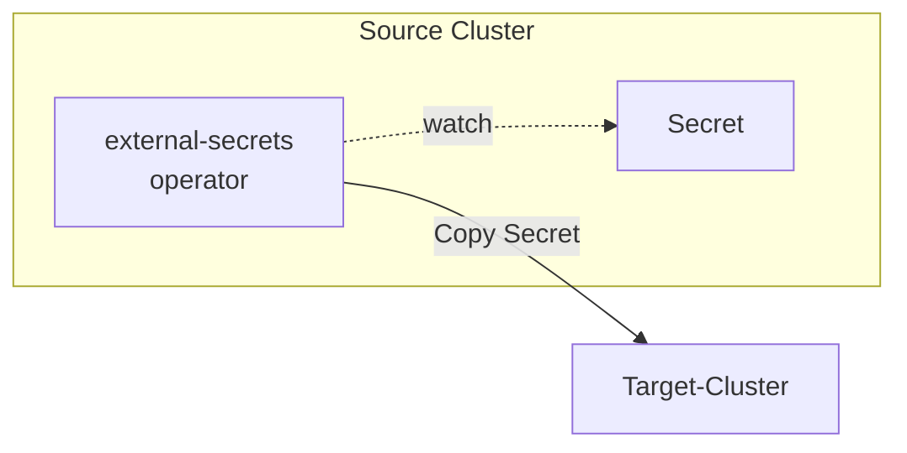

# external-secrets: Sharing Secrets Between Kubernetes Clusters Using PushSecret

The goal is to copy secrets from a source cluster to a target cluster.



## Creating a Shared Network

Create a shared network to enable communication between clusters:

```bash
docker network create shared-net --subnet 172.28.0.0/16 --gateway 172.28.0.1
```

## Building the Source Cluster

source-cluster.yaml

```yaml
apiVersion: k3d.io/v1alpha5
kind: Simple
metadata:
  name: source-cluster
servers: 1
agents: 1
image: docker.io/rancher/k3s:v1.30.0-k3s1
kubeAPI:
  host: 0.0.0.0
  hostIP: 127.0.0.1
  hostPort: "6443"
ports:
  - port: 8080:80
    nodeFilters:
      - loadbalancer
registries:
  create:
    name: registry.localhost
    host: 127.0.0.1
    hostPort: "15000"
network: shared-net
options:
  k3d:
    wait: true
  kubeconfig:
    updateDefaultKubeconfig: true
    switchCurrentContext: true
  k3s:
    extraArgs:
      # Specify different CIDRs for each cluster to avoid range overlap
      - arg: "--cluster-cidr=10.42.0.0/16"
        nodeFilters:
          - server:*
      - arg: "--service-cidr=10.43.0.0/16"
        nodeFilters:
          - server:*
```

```bash
k3d cluster create --config source-cluster.yaml
```

## Building the Target Cluster

target-cluster.yaml

```yaml
apiVersion: k3d.io/v1alpha5
kind: Simple
metadata:
  name: target-cluster
servers: 1
agents: 1
image: docker.io/rancher/k3s:v1.30.0-k3s1
kubeAPI:
  host: 0.0.0.0
  hostIP: 127.0.0.1
  hostPort: "6444" # Changed port
ports:
  - port: 8081:80
    nodeFilters:
      - loadbalancer
registries:
  use:
    - registry.localhost # Use source cluster's registry
network: shared-net
options:
  k3d:
    wait: true
  kubeconfig:
    updateDefaultKubeconfig: true
    switchCurrentContext: true
  k3s:
    extraArgs:
      # Specify different CIDRs for each cluster to avoid range overlap
      - arg: "--cluster-cidr=10.44.0.0/16"
        nodeFilters:
          - server:*
      - arg: "--service-cidr=10.45.0.0/16"
        nodeFilters:
          - server:*
```

```bash
k3d cluster create --config target-cluster.yaml
```

## List Contexts

```bash
kubectl config get-contexts
```

```
CURRENT   NAME                 CLUSTER              AUTHINFO                   NAMESPACE
          k3d-source-cluster   k3d-source-cluster   admin@k3d-source-cluster   
*         k3d-target-cluster   k3d-target-cluster   admin@k3d-target-cluster   
```

## Verify Inter-cluster Communication

Verify that pods in the source cluster can communicate with the Kubernetes API of the target cluster.

debug-pod.yaml

```yaml
apiVersion: v1
kind: Pod
metadata:
  name: debug-pod
spec:
  containers:
  - name: debug
    image: curlimages/curl
    command: ["sleep", "infinity"]
    volumeMounts:
    - name: auth
      mountPath: /tmp/auth
      readOnly: true
  volumes:
  - name: auth
    secret:
      secretName: debug-auth
```

debug-auth-secret.yaml

```yaml
apiVersion: v1
kind: Secret
metadata:
  name: debug-auth
type: Opaque
data:
  client-certificate-data: ... # Paste the Base64 encoded client-certificate-data from target-cluster kubeconfig
  client-key-data: ... # Paste the Base64 encoded client-key-data from target-cluster kubeconfig
```

These values can be obtained using `kubectl config view --raw`.

Create debug pod:

```bash
kubectl config use-context k3d-source-cluster
kubectl apply -f debug-auth-secret.yaml
kubectl apply -f debug-pod.yaml
```

Authenticated request to target cluster's API endpoint:

```bash
kubectl exec debug-pod -- curl -k --cert /tmp/auth/client-certificate-data --key /tmp/auth/client-key-data https://k3d-target-cluster-server-0:6443/api/v1/namespaces
```

If you receive a list of namespaces, the connectivity check including authentication is successful.

## Switch Context to Source Cluster

```bash
kubectl config use-context k3d-source-cluster
```

## Install external-secrets on Source Cluster

```bash
helm repo add external-secrets https://charts.external-secrets.io

helm install external-secrets \
   external-secrets/external-secrets \
    -n external-secrets \
    --create-namespace
```

## Create Target Cluster Client Certificate in Source Cluster

target-cluster-credentials.yaml

```yaml
apiVersion: v1
kind: Secret
metadata:
  name: target-cluster-credentials
  namespace: default
type: Opaque
data:
  client-certificate-data: # Paste the Base64 encoded client-certificate-data from target-cluster kubeconfig
  client-key-data: # Paste the Base64 encoded client-key-data from target-cluster kubeconfig
```

These values can be obtained using `kubectl config view --raw`.

```bash
kubectl apply -f target-cluster-credentials.yaml
```

## Add SecretStore Configuration to Source Cluster

secret-store.yaml

```yaml
apiVersion: external-secrets.io/v1beta1
kind: SecretStore
metadata:
  name: target-cluster
  namespace: default
spec:
  provider:
    kubernetes:
      remoteNamespace: default # Target cluster namespace
      server:
        url: https://k3d-target-cluster-server-0:6443 # Use k3d internal hostname
        # CA certificate can be specified in a ConfigMap, but we'll use direct input here
        caBundle: # Paste the Base64 encoded certificate-authority-data from target-cluster kubeconfig
      auth:
        cert:
          clientCert:
            name: target-cluster-credentials
            key: client-certificate-data
          clientKey:
            name: target-cluster-credentials
            key: client-key-data
```

The caBundle value can be obtained using `kubectl config view --raw`.

```bash
kubectl apply -f secret-store.yaml
```

## Add PushSecret to Source Cluster

push-secret.yaml

```yaml
apiVersion: external-secrets.io/v1alpha1
kind: PushSecret
metadata:
  name: pushsecret-example
  namespace: default
spec:
  # Overwrite existing secrets in provider during sync
  updatePolicy: Replace
  # Delete provider secrets when PushSecret is deleted
  deletionPolicy: Delete
  # Resync interval
  refreshInterval: 10s
  # SecretStore to push secrets to
  secretStoreRefs:
    - name: target-cluster
      kind: SecretStore
  # Target Secret for sync
  selector:
    secret:
      name: my-secret # Secret name in source cluster
  data:
    - match:
        secretKey: username # Secret key in source cluster
        remoteRef:
          remoteKey: my-secret-copy # Secret name in target cluster
          property: username-copy # Secret key in target cluster
    - match:
        secretKey: password # Secret key in source cluster
        remoteRef:
          remoteKey: my-secret-copy # Secret name in target cluster
          property: password-copy # Secret key in target cluster
```

```bash
kubectl apply -f push-secret.yaml
```

## Verify Secret Creation in Target Cluster

```bash
kubectl config use-context k3d-target-cluster
kubectl describe secret my-secret-copy
```

Output:

```
Name:         my-secret-copy
Namespace:    default
Labels:       <none>
Annotations:  <none>

Type:  Opaque

Data
====
password-copy:  11 bytes
username-copy:  5 bytes
```

Check content:

```bash
kubectl-view-secret my-secret-copy --all
```

Output:

```
password-copy='supersecret'
username-copy='admin'
```

## Delete PushSecret

```bash
kubectl config use-context k3d-source-cluster
kubectl delete pushsecret pushsecret-example
```

Verify secret deletion in target cluster:

```bash
kubectl config use-context k3d-target-cluster
kubectl get secret my-secret-copy
```

If you see "Error from server (NotFound): secrets "my-secret-copy" not found", it's successful.

## Cleanup

```bash
k3d cluster delete --config source-cluster.yaml
k3d cluster delete --config target-cluster.yaml
docker network rm shared-net
```